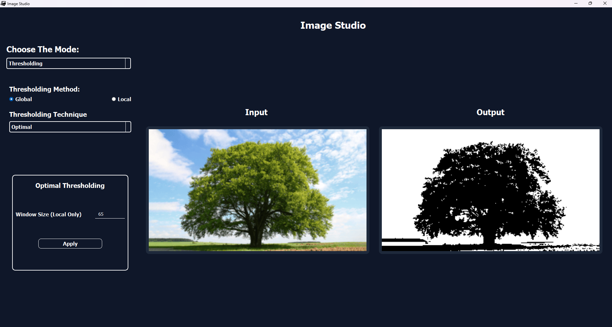
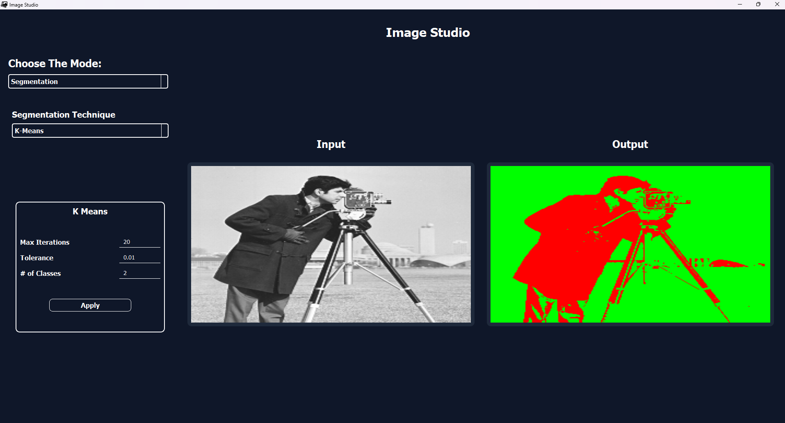

# Image Segmenter Suite

## 🌟 Overview

A comprehensive, professional-grade computer vision application featuring advanced image processing, thresholding, and segmentation algorithms with an intuitive graphical user interface.

### 📸 Program Preview

<div align="center">
   
   <p><em>Main application interface showcasing the Thresholding part </em></p>
</div>

<div align="center">
   
   <p><em>Segmentation Algorithms Mode</em></p>
</div>

## ✨ Key Features

### 🎯 Image Thresholding Algorithms
- **Otsu's Thresholding** - Automatic optimal threshold selection
- **Optimal Thresholding** - Custom optimization-based thresholding
- **Spectral Thresholding** - Frequency domain-based thresholding techniques

### 🔍 Advanced Segmentation Methods
- **K-Means Clustering** - Efficient pixel clustering with customizable cluster count
- **Mean Shift Segmentation** - Density-based segmentation with adaptive bandwidth
- **Region Growing** - Interactive seed-based region segmentation
- **Agglomerative Clustering** - Hierarchical clustering for image segmentation

### 🖥️ User Interface Features
- **Modern Dark Theme** - Professional, eye-friendly interface design
- **Interactive Image Display** - Clickable image regions for algorithm interaction
- **Real-time Parameter Control** - Dynamic adjustment of algorithm parameters
- **Multiple Mode Support** - Seamless switching between different processing modes
- **Comprehensive Image Support** - Supports JPG, PNG, BMP, GIF, and TIFF formats

## 🚀 Quick Start

### Prerequisites

- Python 3.6 or higher
- pip package manager

### Installation

1. **Clone the repository:**
   ```bash
   git clone https://github.com/Youssef-Abo-El-Ela/Image-Studio-CV-Task-04.git
   cd Image-Studio-CV-Task-04
   ```

2. **Install dependencies:**
   ```bash
   pip install -r requirements.txt
   ```

3. **Run the application:**
   ```bash
   python main.py
   ```

### Alternative Installation (pip)

```bash
pip install PyQt5 opencv-python numpy scipy matplotlib
```

## 📖 Usage Guide

### Getting Started

1. **Launch the Application**
   ```bash
   python main.py
   ```

2. **Load an Image**
   - Click the "Browse" button to select an image file
   - Supported formats: JPG, JPEG, PNG, BMP, GIF, TIFF

3. **Select Processing Mode**
   - Use the dropdown menu to choose between:
     - **Thresholding Mode** - For binary image processing
     - **Segmentation Mode** - For advanced image segmentation

### Thresholding Operations

1. **Select Thresholding Algorithm:**
   - **Otsu** - Automatic threshold selection
   - **Optimal** - Custom optimization methods
   - **Spectral** - Frequency-based thresholding

2. **Adjust Parameters:**
   - Use the parameter controls to fine-tune algorithm settings
   - Results update in real-time

### Segmentation Operations

1. **Choose Segmentation Method:**
   - **K-Means** - Specify number of clusters
   - **Mean Shift** - Adjust bandwidth parameters
   - **Region Growing** - Click seed points on the image
   - **Agglomerative** - Set cluster count for hierarchical grouping

2. **Interactive Processing:**
   - For Region Growing: Click on the image to place seed points
   - Adjust algorithm-specific parameters using the control panel
   - View results in the output panel

### Dependencies

```
PyQt5>=5.15.0        # GUI framework
opencv-python>=4.5.0 # Computer vision operations
numpy>=1.21.0        # Numerical computations
scipy>=1.7.0         # Scientific computing
matplotlib>=3.3.0    # Plotting and visualization
```

## Contributors

<table>
  <tr>
    </td>
    <td align="center">
    <a href="https://github.com/karreemm" target="_black">
    
    <br />
    <sub><b>Kareem Abdel nabi</b></sub></a>
    </td>
    <td align="center">
    <a href="https://github.com/Youssef-Abo-El-Ela" target="_black">
    
    <br />
    <sub><b>Youssef Aboelela</b></sub></a>
    <td align="center">
    <a href="https://github.com/aliyounis33" target="_black">
    
    <br />
    <sub><b>Ali Younis</b></sub></a>
    </td>
    <td align="center">
    <a href="https://github.com/louai111" target="_black">
    
    <br />
    <sub><b>Louai Khaled</b></sub></a>
    </td>
      </tr>
</table>

---
